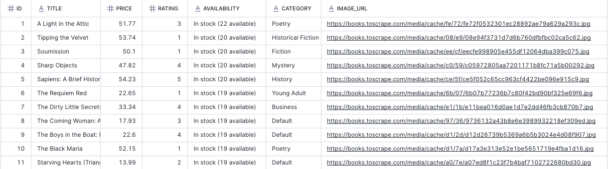
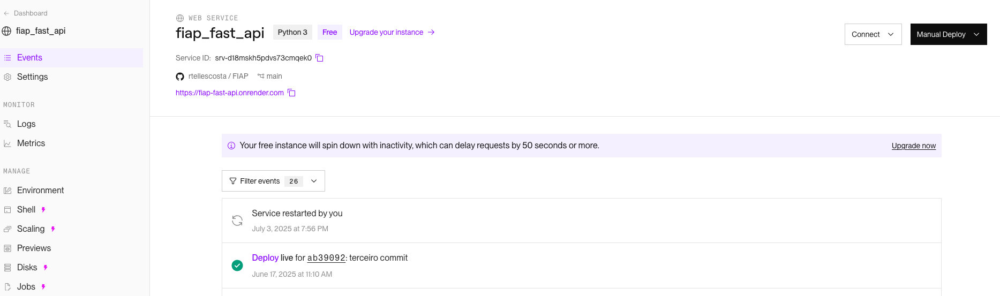

# 📚 Tech Challenge - API Pública de Livros

Projeto desenvolvido para o Tech Challenge da Pós-Tech, Fase 1, com foco em Engenharia de Machine Learning.

O desafio propõe a criação de um pipeline de dados com web scraping, transformação e disponibilização dos dados de livros via API RESTful, com foco em **escalabilidade** e **reusabilidade** para futuros modelos de machine learning.

---

## 🎯 Objetivo

- Criar um pipeline de dados completo.
- Disponibilizar os dados via API pública.
- Preparar a solução para futuros usos em projetos de ML.
- Publicar a solução em ambiente de produção com esteira CI/CD.

---
## 📌 Premissas Atendidas

- Pipeline completo de dados
- API REST funcional
- Web scraping robusto
- Dados estruturados para ML
- Deploy público disponível


---
## 📌 Tecnologias envoldidas

- Python - utilizado para criar o codigo do webscraping

- AWS - utilizado para automatizar o scraping via Lambda Function e armazenar os resultados em S3

- Snowflake - utilizado para integrar com o S3 e fazer a ingestão na tabela final do banco de dados de maneira estruturada

- Plataforma Render - utilizado para expor a API e rotas que irão consumir os dados do Snowflake


---

## 🧩 Arquitetura da Solução


## 🚀 Processo de Deploy


---

## 🗂 Estrutura do Repositório

```
MLET_TC01/
├── api/                  # Implementação da API (FastAPI)
├── scripts/              # Script de Web Scraping (scraper.py)
├── models/               # Modelos ORM com SQLAlchemy
├── database/             # Conexão e setup do SQLite
├── data/                 # Armazenamento local dos dados (.csv)
├── ingest_data.py        # Script de ingestão de dados no banco
├── requirements.txt      # Dependências do projeto
└── README.md             # Este arquivo
```


---

## 🔗 Endpoints da API

### Core
- `GET /api/v1/books` – Lista todos os livros
- `GET /api/v1/books/{id}` – Detalhes de um livro
- `GET /api/v1/books/search?title=&category=` – Busca por título e/ou categoria
- `GET /api/v1/categories` – Lista de categorias
- `GET /api/v1/health` – Verifica status da API

## 🔐 Autenticação com JWT

O projeto conta com autenticação implementada usando **JWT (JSON Web Tokens)**.

### Rotas de autenticação:

- `POST /api/v1/auth/login` – Realiza o login e retorna um token JWT.
- `POST /api/v1/auth/refresh` – Gera um novo token com base no token de refresh.

### Endpoints protegidos

- Endpoints sensíveis como `/api/v1/scraping/trigger` estão protegidos e exigem um token válido.
- Para acessar esses endpoints, inclua o header:
```
Authorization: Bearer <seu_token>
```

Essa implementação garante segurança básica para administração da API e controle de acesso às operações críticas.

### Insights (opcional)
- `GET /api/v1/stats/overview` – Estatísticas gerais
- `GET /api/v1/stats/categories` – Estatísticas por categoria
- `GET /api/v1/books/top-rated` – Melhores avaliações
- `GET /api/v1/books/price-range?min=&max=` – Faixa de preço

---

## 🧩 AWS

A plataforma AWS foi escolhida por fornecer engines escaláveis, facil gerenciamento e baixo custo para o nosso caso de uso

1. **Ingestão:**

A ingestão é realizada por uma lambda function que pode ser disparada manualmente ou via Schedule atraves do AWS Event Bridge(crontab)

A Lambda function realiza o scraping da informações de livros do site https://books.toscrape.com/


2. **Armazenamento:**

O resultado da função Lambda é um arquivo csv no S3  


## 🧩 SNOWFLAKE

A plataforma de dados Snowflake foi escolhida por fornecer um ambiente de dados escalaveis para requisições das apis, baixo esforço de construção do ambiente e de custo gratuito para o desenvolvimento desse trabalho.

1. **Ingestão:**

A ingestão no snowflake é realizada por uma feature chamada SNOWPIPE.

Essa feature tem por objetivo carregar dados de um S3, assim que receber um evento do mesmo, para uma tabela no Snowflake

2. **Armazenamento:**

A tabela no snowflake é chamada TB_BOOKS_TO_SCRAPE e tem o seguinte formato estruturado abaixo

Essa tabela servira de base para o consumo de informação das APIS



---

## 🧩 RENDER

A plataforma Render foi escolhida pelo time para realizar o deploy das APIs utilizando uma URL publica que permitindo que suas rotas sejam acessadas.

Essa plataforma foi escolhida em virtude do minimo esforço de deploy das APIs, visto que é facilmente integravel com o GITHUB, e por possuir plano gratuito que é suficiente para o caso de uso do nosso trabalho

As rotas e apis podem ser acessadas na url: 🔗 https://scrap-api-kwuu.onrender.com




---
## 🎥 Apresentação

🔗 https://www.youtube.com/watch?v=hgaGc_RikiQ

---
