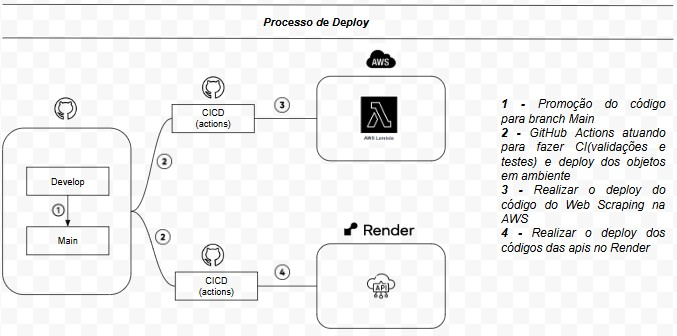
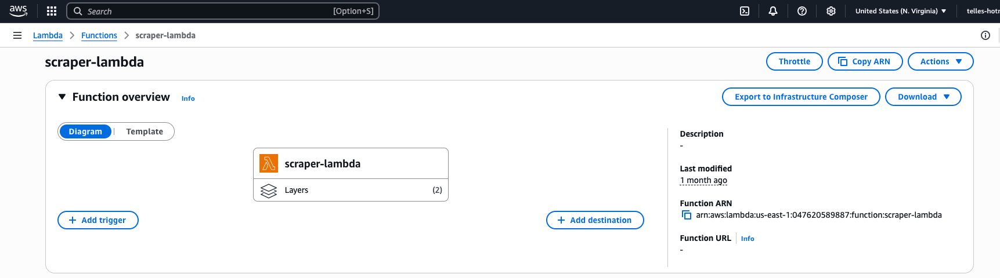
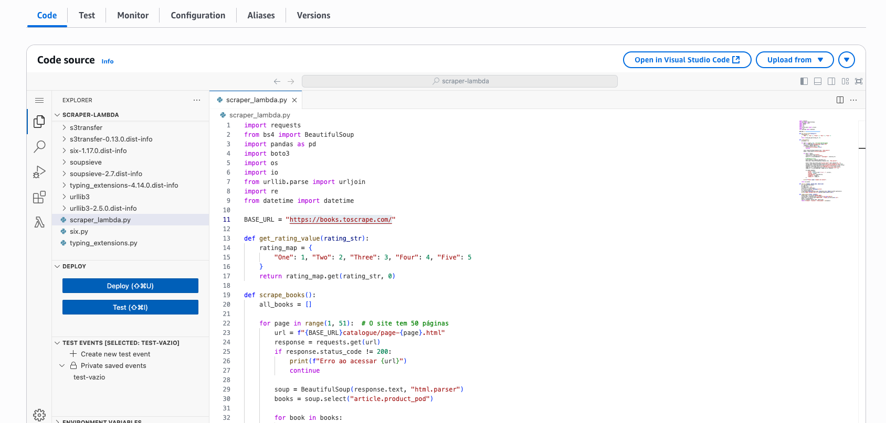
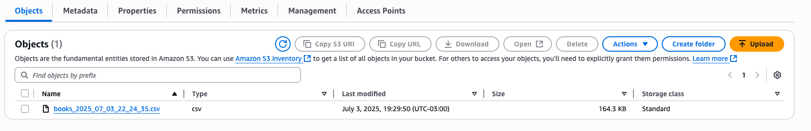

# 📚 Tech Challenge - API Pública de Livros

Projeto desenvolvido para o Tech Challenge da Pós-Tech, Fase 1, com foco em Engenharia de Machine Learning.

O desafio propõe a criação de um pipeline de dados com web scraping, transformação e disponibilização dos dados de livros via API RESTful, com foco em **escalabilidade** e **reusabilidade** para futuros modelos de machine learning.

---

## 🎯 Objetivo

- Criar um pipeline de dados completo.
- Disponibilizar os dados via API pública.
- Preparar a solução para futuros usos em projetos de ML.
- Publicar a solução em ambiente de produção com esteira CI/CD.

## 🧩 Arquitetura da Solução


## 🚀 Processo de Deploy




---

## 📌 Premissas Atendidas

- Pipeline completo de dados
- API REST funcional
- Web scraping robusto
- Dados estruturados para ML
- Deploy público disponível

---

## 🗂 Estrutura do Repositório

```
MLET_TC01/
├── api/                  # Implementação da API (FastAPI)
├── scripts/              # Script de Web Scraping (scraper.py)
├── models/               # Modelos ORM com SQLAlchemy
├── database/             # Conexão e setup do SQLite
├── data/                 # Armazenamento local dos dados (.csv)
├── ingest_data.py        # Script de ingestão de dados no banco
├── requirements.txt      # Dependências do projeto
└── README.md             # Este arquivo
```


---

## 🔗 Endpoints da API

### Core
- `GET /api/v1/books` – Lista todos os livros
- `GET /api/v1/books/{id}` – Detalhes de um livro
- `GET /api/v1/books/search?title=&category=` – Busca por título e/ou categoria
- `GET /api/v1/categories` – Lista de categorias
- `GET /api/v1/health` – Verifica status da API

## 🔐 Autenticação com JWT

O projeto conta com autenticação implementada usando **JWT (JSON Web Tokens)**.

### Rotas de autenticação:

- `POST /api/v1/auth/login` – Realiza o login e retorna um token JWT.
- `POST /api/v1/auth/refresh` – Gera um novo token com base no token de refresh.

### Endpoints protegidos

- Endpoints sensíveis como `/api/v1/scraping/trigger` estão protegidos e exigem um token válido.
- Para acessar esses endpoints, inclua o header:
```
Authorization: Bearer <seu_token>
```

Essa implementação garante segurança básica para administração da API e controle de acesso às operações críticas.

### Insights (opcional)
- `GET /api/v1/stats/overview` – Estatísticas gerais
- `GET /api/v1/stats/categories` – Estatísticas por categoria
- `GET /api/v1/books/top-rated` – Melhores avaliações
- `GET /api/v1/books/price-range?min=&max=` – Faixa de preço

---

## 🧩 AWS

1. **Ingestão:**

A ingestão é realizada por uma lambda function que pode ser disparada manualmente ou via Schedule atraves do AWS Event Bridge(crontab)
A Lambda function realiza o scraping da informações de livros do site https://books.toscrape.com/




2. **Armazenamento:**

O resultado da função Lambda é um arquivo csv no S3  




## 🧩 SNOWFLAKE

1. **Ingestão:**


---

## ⚙️ Como Executar Localmente

1. **Clone o projeto:**
```bash
git clone https://github.com/seuusuario/MLET_TC01.git
cd MLET_TC01
```

2. **Crie e ative o ambiente virtual:**
```bash
python -m venv venv
source venv/bin/activate  # Linux/macOS
venv\Scripts\activate     # Windows
```

3. **Instale as dependências:**
```bash
pip install -r requirements.txt
```

4. **Execute o scraping:**
```bash
python scripts/scraper.py
```

5. **Ingestão dos dados no banco:**
```bash
python ingest_data.py
```

6. **Execute a API localmente:**
```bash
uvicorn api.main:app --reload
```


---

## 🧩 Arquitetura da Solução - ACHO QUE PODEMOS REMOVER ESSA PARTE - DUPLICIDADE

### 🔧 Visão Geral

```
+-------------+      +-------------+      +--------------------+      +-------------+
|   Fonte     | ---> |  Ingestão   | ---> |  Armazenamento     | ---> |   Consumo   |
| (HTML Site) |      |  (Lambda)   |      | (CSV + SQLite DB)  |      | (FastAPI)   |
+-------------+      +-------------+      +--------------------+      +-------------+
```

### 🔁 Etapas do Processo 

1. **Scraping** dos dados do site [books.toscrape.com](https://books.toscrape.com/)
2. Armazenamento dos dados em `.csv`
3. Ingestão no banco SQLite
4. Transformação de campos
5. Exposição via **API RESTful**
6. Consumo por cientistas de dados ou usuários

---

## 🚀 Processo de Deploy

O projeto conta com esteira de CI/CD estruturada para deploy automático:

### 🔄 Fluxo

1. Push do código na branch `main`
2. GitHub Actions executa CI com testes e validações
3. Deploy automático em ambiente de **staging (AWS Lambda)**
4. Deploy final em **produção (Render)**


---

## 🎥 Apresentação

[🔗 Link para vídeo de apresentação (inserir link quando disponível)]

---

## 💡 Próximos Passos (Extras)

- 🔒 Implementar autenticação com JWT
- 📊 Criar dashboard com Streamlit
- 🧠 Adicionar endpoints para ML
